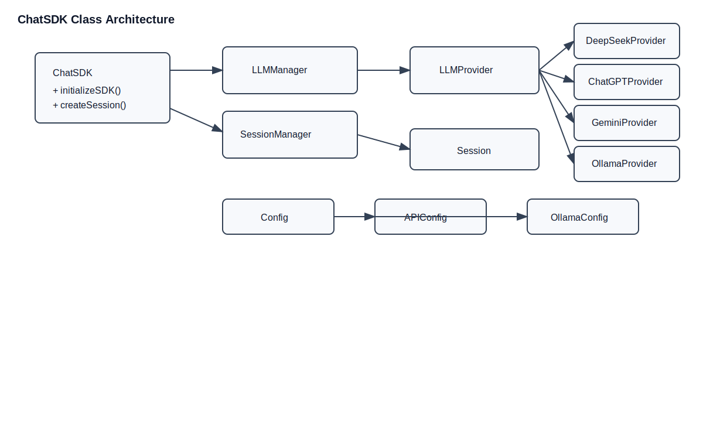

# ChatSDK (C++)

A **C++17** SDK for integrating LLMs with a unified interface. It wraps both cloud model APIs and local Ollama models, and provides session management, message persistence, and both full/streaming responses.


## Clone Repository

```bash
git clone https://gitee.com/zhibite-edu/ai-model-acess-tech.git
cd ai-model-acess-tech
```

> If you are using a mirror/fork of this project, replace it with your own repository URL.

---

## Project Structure Diagram (PlantUML)

The following diagram is generated from the PlantUML source file `docs/diagrams/class-architecture.puml`, showing relationships among ChatSDK, session management, model management, and providers.



---

## Features

- Unified multi-model access (currently implemented):
  - DeepSeek: `deepseek-chat`
  - OpenRouter (OpenAI): `openai/gpt-4o-mini`
  - OpenRouter (Gemini): `google/gemini-2.0-flash-001`
  - Local Ollama models (e.g. `gemma3:270m`)
- Single `ChatSDK` entry point
- Session management: create, query, list, delete
- Messaging modes:
  - Full response: `sendMessage`
  - Streaming response: `sendMessageIncremental`
- SQLite-based persistence for sessions and messages
- Built-in logging (spdlog)

---

## Project Structure

```text
.
├── AIModelAccess
│   ├── sdk
│   │   ├── CMakeLists.txt
│   │   ├── include
│   │   │   ├── ChatSDK.h
│   │   │   ├── common.h
│   │   │   ├── LLMProvider.h
│   │   │   ├── DeepSeekProvider.h
│   │   │   ├── ChatGPTProvider.h
│   │   │   ├── GeminiProvider.h
│   │   │   ├── OllamaProvider.h
│   │   │   └── ...
│   │   └── src
│   └── test
├── README.md
└── README.en.md
```

---

## Requirements

- CMake >= 3.10
- A C++17 compiler (g++ / clang++)
- Dependencies (from `sdk/CMakeLists.txt`):
  - `jsoncpp`
  - `fmt`
  - `spdlog`
  - `sqlite3`
  - `OpenSSL`

---

## Features

- Unified multi-model access (currently implemented):
  - DeepSeek: `deepseek-chat`
  - OpenRouter (OpenAI): `openai/gpt-4o-mini`
  - OpenRouter (Gemini): `google/gemini-2.0-flash-001`
  - Local Ollama models (e.g. `gemma3:270m`)
- Single `ChatSDK` entry point
- Session management: create, query, list, delete
- Messaging modes:
  - Full response: `sendMessage`
  - Streaming response: `sendMessageIncremental`
- SQLite-based persistence for sessions and messages
- Built-in logging (spdlog)

---

## Project Structure

```text
.
├── AIModelAccess
│   ├── sdk
│   │   ├── CMakeLists.txt
│   │   ├── include
│   │   │   ├── ChatSDK.h
│   │   │   ├── common.h
│   │   │   ├── LLMProvider.h
│   │   │   ├── DeepSeekProvider.h
│   │   │   ├── ChatGPTProvider.h
│   │   │   ├── GeminiProvider.h
│   │   │   ├── OllamaProvider.h
│   │   │   └── ...
│   │   └── src
│   └── test
├── README.md
└── README.en.md
```

---

## Requirements

- CMake >= 3.10
- A C++17 compiler (g++ / clang++)
- Dependencies (from `sdk/CMakeLists.txt`):
  - `jsoncpp`
  - `fmt`
  - `spdlog`
  - `sqlite3`
  - `OpenSSL`

---
 
## Build and Install

From repository root:

```bash
cd AIModelAccess/sdk
mkdir -p build && cd build
cmake ..
make -j
sudo make install
```

Default install paths (from CMake install rules):

- Static library: `/usr/local/lib`
- Headers: `/usr/local/include/ai_chat_SDK`

---

## Core API Overview

Header:

```cpp
#include <ai_chat_SDK/ChatSDK.h>
```

Key methods in `ChatSDK`:

- `bool initializeSDK(const std::vector<std::shared_ptr<Config>>& configs)`
- `std::string createSession(const std::string& modelName)`
- `std::shared_ptr<Session> getSession(const std::string& sessionId)`
- `std::vector<std::string> getSessionLists() const`
- `bool deleteSession(const std::string& sessionId)`
- `std::vector<LLMInfo> getAvailableModels() const`
- `std::string sendMessage(const std::string& sessionId, const std::string& message)`
- `std::string sendMessageIncremental(const std::string& sessionId, const std::string& message, callback)`

Related data structures (`Config`, `APIConfig`, `OllamaConfig`, `Session`, `Message`) are defined in:

- `AIModelAccess/sdk/include/common.h`

---

## Quick Start

```cpp
#include <iostream>
#include <memory>
#include <vector>
#include <ai_chat_SDK/ChatSDK.h>

int main() {
    ai_chat_sdk::ChatSDK sdk;

    // 1) Model config
    auto deepseek = std::make_shared<ai_chat_sdk::APIConfig>();
    deepseek->_modelName = "deepseek-chat";
    deepseek->_apiKey = std::getenv("deepseek_apikey");
    deepseek->_temperature = 0.7f;
    deepseek->_max_tokens = 2048;

    std::vector<std::shared_ptr<ai_chat_sdk::Config>> configs = {deepseek};

    // 2) Initialize
    if (!sdk.initializeSDK(configs)) {
        std::cerr << "initializeSDK failed" << std::endl;
        return 1;
    }

    // 3) Create session
    auto sessionId = sdk.createSession("deepseek-chat");
    if (sessionId.empty()) {
        std::cerr << "createSession failed" << std::endl;
        return 1;
    }

    // 4) Streaming call
    auto callback = [](const std::string& chunk, bool done) {
        std::cout << chunk;
        if (done) std::cout << "\n[done]" << std::endl;
    };

    auto full = sdk.sendMessageIncremental(sessionId, "Hello, please introduce yourself.", callback);
    std::cout << "\nFull response: " << full << std::endl;

    return 0;
}
```

---

## Consumer CMake Example

```cmake
cmake_minimum_required(VERSION 3.10)
project(AIChatDemo)

set(CMAKE_CXX_STANDARD 17)
set(CMAKE_CXX_STANDARD_REQUIRED ON)

add_executable(AIChatDemo main.cpp)

find_package(OpenSSL REQUIRED)
include_directories(${OPENSSL_INCLUDE_DIR})
link_directories(/usr/local/lib)

target_link_libraries(AIChatDemo PRIVATE
    ai_chat_SDK
    fmt
    jsoncpp
    OpenSSL::SSL
    OpenSSL::Crypto
    gflags
    spdlog
    sqlite3
)
```

---

## Notes

- Use environment variables for API keys; do not hardcode secrets.
- For Ollama, ensure local service is running and models are pulled.
- If you only use cloud models, only `APIConfig` is needed; for local models, use `OllamaConfig`.

## License

See `LICENSE` in the repository root.
